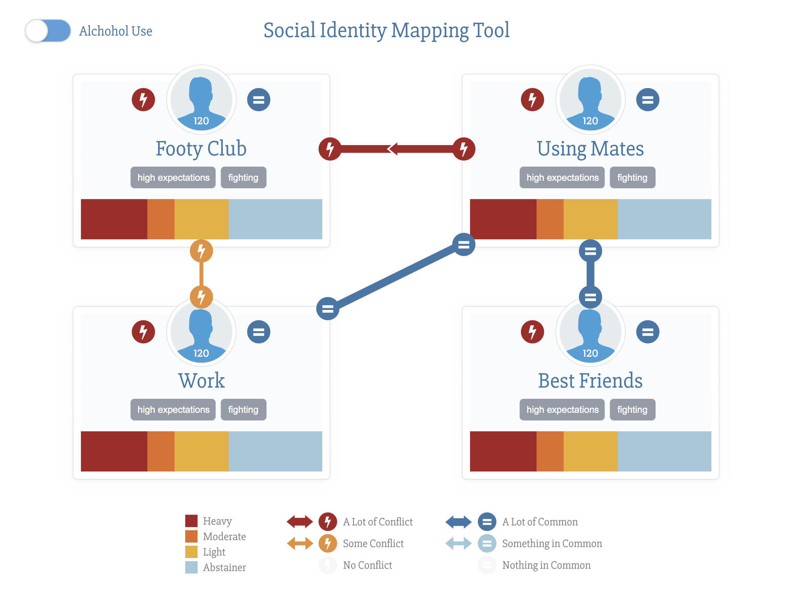

# Social Identity Mapping Tool

This project is the initial results of the SONAR team at [Health Hack](http://healthhack.com.au/) Melbourne 2015.  [Turning Point](http://www.turningpoint.org.au/) requested that we:

> Develop a prototype of a paper-based tool as an interactive app (tablet / web) that allows people to audit, visualise and map their social relationships and substance use and other risky behaviours.

We spent a measure of our initial time collaborating on UX, and came up with what we feel (but have not been able to test yet) are improvements to the data collection / interview process, and to the presentation / comprehensibility of the tool.

The prototype doesn't completely implement the design we came up with: 

.

## Testing the tool

Super lean style :) I've added save to / load from file functions so you can now try it out for yourself (the roundabout way!) by editing a json template and then uploading it to the tool.

TLDR; screencast: https://memelab.wistia.com/medias/lgux1kxxr6

- visit http://turning-point.github.io/Social-Identity-Mapping-Tool/
- click download at top right to get a template of dummy data
- visit http://jsoneditoronline.org/#
- upload your json (or paste the data into the left column)
- click the right arrow between the two columns
- edit your data
- click the left arrow between columns
- click save to file (at top right)
- back on SIMT, upload the file

We're side stepping privacy concerns by not saving any data (there's no back end!).

## The future

Currently, we're just displaying the results of dummy data, and there is no backend.

- add a create / update form interface for entering data
- load and save data to parse.com

We had all sorts of grandiose ideas, which we hope can be developed in future.

## Installing, running the prototype

Requires [node.js](https://docs.npmjs.com/getting-started/installing-node): 

    cd <project-directory>
    npm install
    npm start

To serve the files, open another terminal tab and run:

    cd <project-directory>
    npm install -g browser-sync
    browser-sync start --server --directory --files "**"
